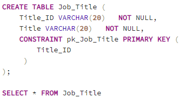
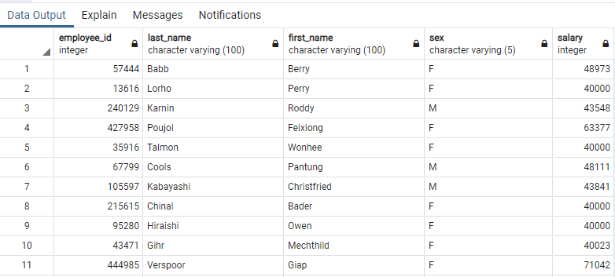

# SQL Challenge

## Table of contents
* [About the Project](#about-the-project)
* [Data Modeling](#data-modeling)
* [Data Engineering](#data-engineering)
* [Data Analysis](#data-analysis)
* [Salary Analysis](#salary-analysis)
* [Conclusion](#conclusion)
* [Resources](#resources)
* [Contact](#contact)

## About the Project

As a recent employee at Pewlett Hackard, I have been tasked to organize and analyze data for employees at the corporation in the 1980s and 1990s. I have used a database mapping tool to visualize all of the data and then PostgreSQL to analyze this information. Below you will see a step by step guide to how the information was modeled and reviewed. 

## Data Modeling

To visualize my data, I used an Entity Relational Database called [Quick Database Diagrams]( https://app.quickdatabasediagrams.com/#/) . First, I reviewed my 6 different `csv` files

* [employees.csv](https://github.com/Ssimoes48/SQL_Challenge/blob/main/Employee_SQL/Resources/employees.csv)
* [dept_emp.csv](https://github.com/Ssimoes48/SQL_Challenge/blob/main/Employee_SQL/Resources/dept_emp.csv)
* [dept_manager.csv](https://github.com/Ssimoes48/SQL_Challenge/blob/main/Employee_SQL/Resources/dept_manager.csv)
* [salaries.csv](https://github.com/Ssimoes48/SQL_Challenge/blob/main/Employee_SQL/Resources/salaries.csv)
* [titles.csv](https://github.com/Ssimoes48/SQL_Challenge/blob/main/Employee_SQL/Resources/titles.csv)
* [departments.csv](https://github.com/Ssimoes48/SQL_Challenge/blob/main/Employee_SQL/Resources/departments.csv)

After reviewing the data, I was able to determine what columns would be Primary Keys for when comparing my data files. I then created tables for each `csv` file and included the details for the data going into each column. For example, numbers were assigned as `INTEGERS` and names and personal information were assigned as `VARCHAR` . 

Once my tables were created in the mapping tool, I then linked the tables on Primary keys and other data relationships. I linked `employee_id` and other `id` information. 

Below is what the code looks like in the data mapping tool. Once I completed organizing the data, I exported this into a file to use in `PostgreSQL` . 

## Data Engineering

After exporting the [schemata](https://github.com/Ssimoes48/SQL_Challenge/blob/main/Employee_SQL/ERDexport.sql) from the data mapping tool, I used the code to create my tables in `pgAdmin4` . The code exported with `" "` around the variables, so I deleted the `quotes` when transferring the code to easier manipulate the data later. 

The code includes the `CREATE TABLE` command and then includes one line per column of data. Each column has `syntax` for the type of data included in the cells and the command `NOT NULL` to only include cells with information included and not blank cells. The end `syntax` refers to the `Primary Key` which I set to be the `Employee_ID` .

Employee Table: 

Department Table: includes `Department_ID` and `Department_Name`

Department Manager Table: includes `Department_ID` and manager `Employee_ID` 

Employee Department Table: includes `Employee_ID` and `Department_ID` 

Job Title Table: includes `Title_ID` and `Title`

Salary Table: includes `Employee_ID` and `Salary` amount

By mapping my data tables in the mapping tool, I created `CONSTRAINTS` ,  `PRIMARY KEYS` , and `FOREIGN KEYS` . These criteria help my data tables interact when combining information into one `queries` . 

## Data Analysis

1. List the following details of each employee: employee number, last name, first name, sex, and salary.

Query : To show this view, I used an `INNER JOIN` on the `Employee` and `Salaries` tables. I `joined` the data on the `Employee_ID` . 

Data Output: 

2. List first name, last name, and hire date for employees who were hired in 1986.

Query: To show this view, I used a `WHERE` function to only show Employees who were hired in the year 1986 - `WHERE hire_data LIKE ‘%1986%’ ` . If you put the search value in `’% %’` it searches similarly to ‘contains’. 

Data Output: 

3. List the manager of each department with the following information: department number, department name, the manager's employee number, last name, first name.

Query: To display this view, I had to `INNER JOIN` 3 different data tables- `Employee` , `Managers` , and `Departments` . I joined the `Manager` and `Employee` tables on `Employee_ID` . I joined the `Managers` and `Departments` on `Department_ID` . 

Data Output: 

4. List the department of each employee with the following information: employee number, last name, first name, and department name.

Query: This view is similar to the view in question 3 accept the `INNER JOIN` is on the `Employee` , Employee_Department` and `Department` tables instead of `Manager` departments. I also joined the tables on `Employee_ID` and `Department_ID` . 

Data Output: 

5. List first name, last name, and sex for employees whose first name is "Hercules" and last names begin with "B."

Query: To show this view, I used a `WHERE` statement with 2 criteria- `WHERE` the `First_Name` is equal to `’Hercules’` and `WHERE` the `Last_Name` starts with the letter `’%B%”` . 

Data Output: 

6. List all employees in the Sales department, including their employee number, last name, first name, and department name.

Query: To show this view, I had to use `INNER JOIN` 3 tables- `Employee` , `Employee_Department` , and `Department`. This is how the view is able to display the Employee information as well as the `Department_Name` . I also used a `WHERE` statement to only show Employee’s who are in the `Sales` department. 

Data Output: 

 

7. List all employees in the Sales and Development departments, including their employee number, last name, first name, and department name.

Query: This view is similar to the view in the above question accept in the `WHERE` statement, there are 2 criteria- the `Department ` is equal to `Sales`  `OR`  `Development` . 

Data Output: 

8. In descending order, list the frequency count of employee last names, i.e., how many employees share each last name.

Query: To show this view, I used a `COUNT` function to count the number of times a `Last_Name` was shared by employees. I labeled this new count as ‘Frequency’ to appear as a new Column in the Data Output. To count the ‘like’ `Last_Names` , I used a `GROUP BY` function to group the same `Last_Name`. Then I sorted the data in descending order by using an `ORDER BY` command. 

Data Output: 

## Salary Analysis

BONUS 

## Conclusion

## Resources

Link to [Jupyter Notebook]( https://github.com/Ssimoes48/SQL_Challenge/blob/main/employee_db.ipynb)

Link to [SQL Employee Database](https://github.com/Ssimoes48/SQL_Challenge/blob/main/Employee_SQL/employee_db.sql)

## Contact
Sara Simoes
